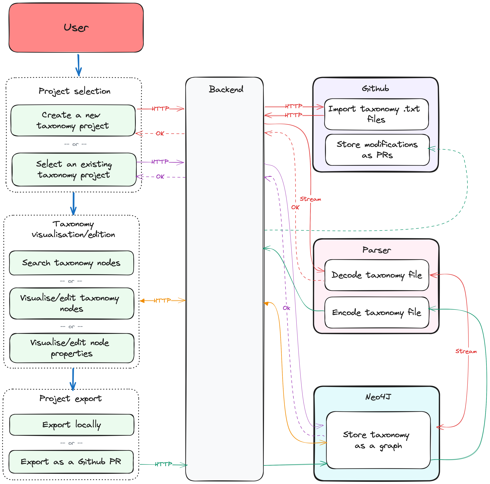

# Taxonomy Editor

<picture>
  <source media="(prefers-color-scheme: dark)" srcset="./doc/assets/off-logo-horizontal-dark.svg?">
  <source media="(prefers-color-scheme: light)" srcset="./doc/assets/off-logo-horizontal-light.svg?">
  
</picture>

   

## What is this project about?

TLDR: Taxonomies are at the 🧡 of Open Food Facts data structure. This project provides an user-friendly editor for editing taxonomies easily.

The Open Food Facts database contains a lot of information on food products, such as ingredients, labels, additives etc.

Because food industry evolves and there can be local peculiarities, we always let people freely enter informations (with suggestions) and we structure afterwards. Structured informations can be more easily exploited (for example to compute the Nutri-Score, detect allergens, etc.).
Taxonomy also brings more informations about products (for example, if an ingredient is vegan, a link to other databases like agribalyse or wikidata…).
Hence, taxonomies are at the heart of data structures in the Open Food Facts database and must be maintained properly.
For more information see the [wiki page about Taxonomies](https://wiki.openfoodfacts.org/Global_taxonomies).

Currently a taxonomy in Open Food Facts is a raw text file containing a Directed Acyclic Graph (DAG) where each leaf node has one or more parent nodes.  
The [taxonomy files present in Open Food Facts](https://github.com/openfoodfacts/openfoodfacts-server/tree/main/taxonomies) are long to read (ingredients.txt taxonomy alone has around 80000 lines!) and cumbersome to edit by contributors. It's also difficult to have a high level overview of a taxonomy or grasp its structure.

This project aims to provide a web based user-friendly interface for editing taxonomies with ease.

This tool can help a lot:

- enable searching and navigating the taxonomy
- enable anyone to contribute translations and synonyms, thus enriching the taxonomy
- help spot problems in the taxonomy (missing translations, missing paths, etc.), and get useful statistics about it
- provide helpers to assist power contributors in enriching the taxonomy (eg. find corresponding wikidata entry)
- offer an API to the taxonomy for third party applications (complementing the existing API)

## Why is this project appealing?

- Python and ReactJS tech stack (a powerful combo)
- Runs on a easy-to-learn graph database - Neo4J, using which you can do a lot of useful and interesting requests
- not so huge and focused, you can quickly get your hands on it
- it can have a huge impact for Open Food Facts:
  - more language support: reaching more countries
  - better analysis of ingredients: more allergy detection, potential finer computation of environment scorer
  - better classification of products: enable product comparisons, environment score computations, etc.
  - enabling more taxonomies: for example on brands to know food producers

## How to help

We track priorities and on-going tasks in:

- [GitHub Project](https://github.com/orgs/openfoodfacts/projects/108/views/1)
- [Meeting Notes](https://docs.google.com/document/d/1tdYkUmoRU8BxFPdCwtewoUi7PV8PmDlXtExOcPYyu-I/edit#)

You can join our [slack](https://slack.openfoodfacts.org) in **#taxonomy-editor** channel to talk.

## Getting Started

- Check out the Taxonomy Editor in our pre-production environment:
  - The UI: https://ui.taxonomy.openfoodfacts.net/
  - The API: https://api.taxonomy.openfoodfacts.net/
- Developer documentation:
  - [Setup a dev environment](./doc/introduction/setup-dev.md)
  - [Docker Compose Setup](./doc/how-to-guides/docker-compose-setup.md)
  - [Contributing Guidelines](./CONTRIBUTING.md)
- Translate: Use [Crowdin](https://crowdin.com/project/openfoodfacts), project Open Food Facts.
- Visit [this link](https://github.com/openfoodfacts/taxonomy-editor/issues) to report issues, give feature requests etc.

## Documentation

Please visit the [doc folder](./doc) for more documentation about the Taxonomy Editor.
This documentation tries to follow as much as possible the documentation system from [Diataxis](https://diataxis.fr/).

## User interface

<h2> Screenshots </h2>

## 🎨 Design & User interface
- We strive to thoughfully design every feature before we move on to implementation, so that we respect Open Food Facts' graphic charter and nascent design system, while having efficient user flows.
- [ Mockups on the current design and future plans to discuss](https://www.figma.com/file/7QxD2pOnVntjDPqbHHPGHv/Taxonomy-Editor?t=4YadI2GgSAXcPnlo-0)
- Are you a designer ? [Join the design team](https://github.com/openfoodfacts/openfoodfacts-design)

## Contributors

